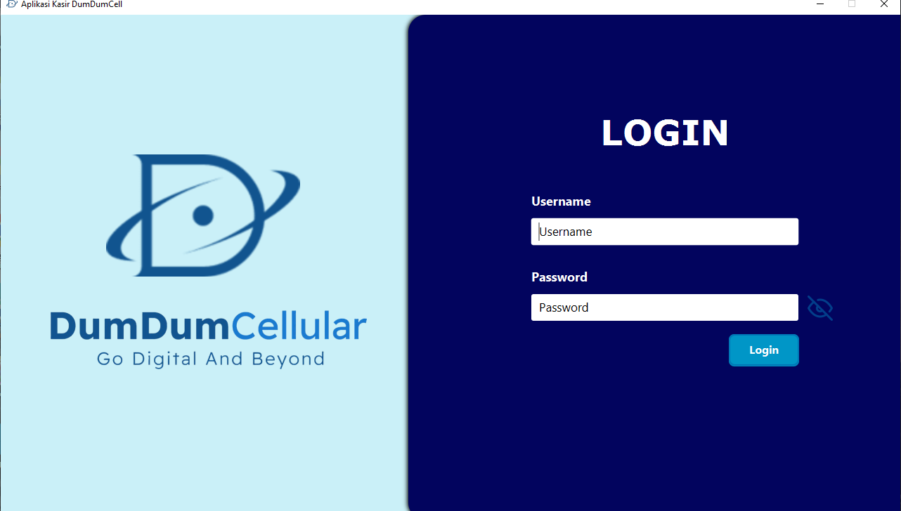

<h1 align="center">Aplikasi Kasir DumDumCell</h1>

<b>Aplikasi Kasir DumDumCell</b> adalah aplikasi kasir yang dirancang untuk menunjang operasional bisnis DumDum Cellular secara efisien dan modern. Aplikasi ini mendukung proses transaksi penjualan, pemantauan stok barang, hingga penyajian laporan penjualan secara otomatis. Dengan dua level akses, yaitu karyawan dan pemilik, sistem ini memastikan pengelolaan data lebih aman dan terstruktur. Fitur-fitur seperti login menggunakan RFID, pemindaian barcode produk, serta pencetakan struk secara otomatis turut hadir untuk mempercepat dan mempermudah operasional. Tampilan yang user-friendly juga memudahkan pengguna dalam menavigasi setiap halaman yang tersedia.

 

## 🖼️ Tampilan Aplikasi

Berikut beberapa tampilan dari aplikasi kasir DumDumCell:

  <table>
    <tr>
      <td align="center">
        <strong>🔠Halaman Login</strong> 
        
      </td>
      <td align="center">
        <strong>🠠Halaman Beranda</strong> 
        
      </td>
    </tr>
    <tr>
      <td align="center">
        <strong>🛒 Halaman Transaksi Jual</strong> 
        
      </td>
      <td align="center">
        <strong>📊 Halaman Laporan</strong> 
        
      </td>
    </tr>
  </table>

 

## ✨ Fitur Unggulan

- 💳 **Login menggunakan RFID** untuk keamanan dan kecepatan
- 📦 **Manajemen stok barang** real-time
- 🧾 **Pencetakan struk otomatis** setelah transaksi
- 📊 **Pembuatan laporan secara otomatis** untuk memudahkan pemantauan operasional bisnis
- 📷 **Pemindaian barcode produk** untuk transaksi cepat
- 🖥️ **Tampilan user-friendly** memudahkan navigasi dan penggunaan

 

## 🎥 Demo Aplikasi

 
<em>Klik gambar di atas untuk menonton demo aplikasi di YouTube</em>

 

## 🧩 Versi

Versi saat ini: **v1.0.0**

 

## 📬 Kontak
📧 bertramrayhan1357@gmail.com
